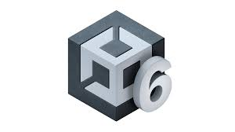

# 🎮 NitroRogue

## 🚀 프로젝트 소개
> 
 
** Unity 엔진을 기반으로 제작된 멀티플레이 로그라이크 게임으로, 여러 플레이어가 협력하여 점차 강해지는 적을 상대하며 생존을 이어가는 전투 중심의 구조로 설계하였다. 전투를 통해 능력치를 강화하고 협동을 통해 더 높은 난이도의 적을 공략하도록 구성하였으며, 서버는 매치 관리, 몬스터 스폰과 경기 진행, 플레이어 동기화를 담당하고 클라이언트는 조작과 전투, UI 처리를 수행하여 안정적이고 몰입감 있는 멀티플레이 환경을 구현하였다. **
## 🔥 주요 특징

* **실시간 4인 협동 플레이**
*  > 
  친구들과 함께 몬스터를 상대하며 전투의 짜릿함을 느껴보세요.

* **다양한 무기와 아이템**
  > 
  근접 무기부터 원거리 무기, 특수 아이템까지! 다양한 조합으로 전략적인 플레이 가능.

* **다채로운 맵과 난이도**
* > 
  각기 다른 전략을 요구하는 다양한 전장과 점점 강해지는 적들에 도전하세요.

* **실시간 전투 및 동기화**
  Mirror 기반 네트워크를 활용한 안정적인 실시간 전투 경험 제공.

## 🛠️ 기술 스택
> 
* **game-engine**: Unity

> 
* **api**: Mirror
  
## 👥 팀원

이 프로젝트는 네 명의 개발자가 함께 협력하여 제작했습니다.

* 김동환
* 이성민
* 황서진
* 김민준

## 🎯 프로젝트 목표

* 네트워크 환경에서 **플레이어 동기화 문제 해결**
* **실시간 멀티게임 플레이의 안정성** 확보
* **다양한 맵 및 게임 모드** 지속 추가
* 사용자 피드백 기반 **UX 개선**

## 🧠 개발 로직 및 구조

> 
## 💬 느낀 점

> * 김동환
  * 이성민
  * 황서진
  * 김민준

